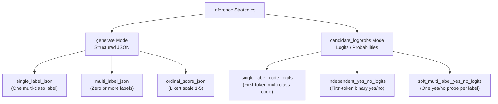

# Review of LLM Inference & Classification Strategies

This document provides a detailed review, explanation, and efficiency analysis of the different classification and scoring strategies implemented in the generic experiment framework (`experiment-cli/`).

---

## 1. Overview of Strategies

The framework supports two core request modes (`request_mode`):
1. **`generate`**: Generates a structured JSON response under JSON Schema constraints.
2. **`candidate_logprobs`**: Captures raw probability scores (logits) of a single target token to determine classes.

Using these two modes, the supplied configurations implement six inference contracts:



---

## 2. Detailed Strategy Mechanics

### Strategy 1: `single_label_json` (Multi-class via JSON)
* **How it works**: The prompt asks the model to output a single label corresponding to the classification task.
* **Output structure**: Enforced by `schema-single-label.json` to be a JSON object containing a `"label"` key with values matching the allowed enum (e.g. `["alpha", "beta", "gamma"]`).
  ```json
  { "label": "alpha" }
  ```
* **Constraint Enforcement**: Uses vLLM's `StructuredOutputsParams` (guided decoding via context-free grammars).

### Strategy 2: `multi_label_json` (Multi-label via JSON)
* **How it works**: The prompt asks the model to output all labels from the label set that apply to the input text.
* **Output structure**: Enforced by `schema-multi-label.json` to return a JSON list of strings under `"labels"`.
  ```json
  { "labels": ["alpha", "gamma"] }
  ```
* **Constraint Enforcement**: Enforces a list of strings matching the allowed categories.

### Strategy 3: `ordinal_score_json` (Ordinal scaling via JSON)
* **How it works**: The prompt asks the model to output a numeric score representing the strength of evidence or category rating.
* **Output structure**: Enforced by `schema-ordinal-score.json` to return an integer between `1` and `5` inclusive.
  ```json
  { "score": 3 }
  ```
* **Constraint Enforcement**: Limits output to a valid Likert scale integer.

### Strategy 4: `single_label_code_logits` (Multi-class via Logits)
* **How it works**:
  1. The prompt formats mapping codes (e.g., `A`, `B`, `C`) and instructs the model: *"Choose exactly one configured code"* and *"Return exactly one candidate token"*.
  2. The runner requests `max_completion_tokens: 1` (or `max_tokens=1` in-process).
  3. The runner requests token logprobs for the top `K` candidates (where $K = \min(20, \text{len(candidates)} + 5)$).
  4. The runner extracts the probability (logprob) of each configured candidate code at the first token position. If a candidate code does not appear in the top $K$ tokens, it is assigned $-\infty$.
* **Output structure**: A dictionary of candidates and their log-probabilities.
  ```json
  {
    "A": -0.15,
    "B": -4.20,
    "C": -12.5
  }
  ```

### Strategy 5: `independent_yes_no_logits` (Binary classification via Logits)
* **How it works**: Identical in mechanism to `single_label_code_logits`, but the candidate set is fixed to `["yes", "no"]`. The runner extracts the relative logprobs of the model generating `"yes"` versus `"no"` as the first token response to a binary question.
* **Output structure**:
  ```json
  {
    "yes": -0.05,
    "no": -6.12
  }
  ```

### Strategy 6: `soft_multi_label_yes_no_logits` (Per-label binary logits)

* **How it works**: The runner expands each source item over the configured
  label set and issues one independent yes/no request per label.
* **Output structure**: Each Parquet row retains the source item ID,
  `target_label`, and the raw yes/no candidate log-probabilities. Thresholding
  and metric computation are left to an independent evaluator.

---

## 3. Efficiency Evaluation

The efficiency of each strategy is determined by the **decoding cost**, **constraint handling**, and **batching behavior**.

### A. Generation vs. Logits (Token cost)

| Metric | JSON Strategies (`single_label_json`, etc.) | Logits Strategies (`single_label_code_logits`, etc.) |
| :--- | :--- | :--- |
| **Token Budget (`max_tokens`)** | `16` or `32` tokens | **`1` token** |
| **Decoding Steps** | Autoregressive (multiple forward passes) | Single forward pass (1 step) |
| **Format Validation** | Required (schema parsing, regex, retries on failure) | Guaranteed (no JSON syntax or keys to parse) |
| **Relative GPU Compute Cost** | **Moderate/High** (16-32x more generation passes) | **Extremely Low** (minimal compute per row) |

> [!TIP]
> **Efficiency Verdict:** The logits-based strategies (`single_label_code_logits`, `independent_yes_no_logits`) are **highly efficient**. By generating only **1 token** and extracting its log-probabilities, you reduce generation costs by **16x to 32x** compared to generating structured JSON strings.

---

### B. vLLM Guided Decoding Efficiency
For JSON variants, the framework utilizes vLLM's `StructuredOutputsParams` (backed by context-free grammar constraints):
* **Pros**: It forces the model's logits during generation to conform strictly to the JSON schema. This guarantees 100% valid JSON and eliminates the need for expensive text post-processing or retries.
* **Cons**: Constrained decoding can add a small CPU overhead during vocabulary masking. However, for small schemas (like ours with 1-5 keys), this overhead is negligible, and it is significantly more efficient than unconstrained generation that requires retries.

---

### C. System-level Optimizations in the Framework

The implementation in `experiment_cli.py` contains several excellent production-grade optimizations that ensure high efficiency:

1. **Automatic Prefix Caching**:
   * Enabled via `enable_prefix_caching: true`.
   * **Why it's efficient**: All variants share identical prompt components (like `system.md`, `context.md`, etc.). Prefix caching stores the Key-Value (KV) cache of these prompts in GPU memory, avoiding redundant computation for subsequent batches.
2. **Dynamic Batch Size Tuning (`batch.mode: auto`)**:
   * The framework automatically warms up and tunes the optimal batch size (`[1, 2, 4, 8, 16, 32, 64]`) per variant.
   * If a batch triggers an Out-Of-Memory (OOM) error, the engine catches `BackendFailure` and halves the batch size (`on_failure: halve`), resuming cleanly rather than crashing.
3. **Resource Guardrails**:
   * Implements strict CPU affinity and caps PyTorch, BLAS, and tokenizer thread pools (`thread_pool_size: 1`).
   * Prevents thread over-subscription on multi-core CPU hosts when vLLM launches subprocesses.
4. **Asset Caching**:
   * Uses `@cache` (`_read_asset`) to cache static markdown prompt fragments in-memory, avoiding disk I/O bottlenecks.

---

## 4. Implementation details

### Tokenizer whitespace aggregation

Tokenizers may represent `" A"` and `"A"` with different token IDs. Candidate
aggregation treats their stripped forms as equivalent and combines their
probability mass:
  ```python
  def aggregate_candidate_logprobs(raw_logprobs: list[tuple[str, float]], candidates: list[Any]) -> dict[str, float]:
      import math
      grouped = {}
      for token, logprob in raw_logprobs:
          stripped = token.strip()
          grouped.setdefault(stripped, []).append(logprob)
      aggregated = {}
      for stripped, logprobs in grouped.items():
          if len(logprobs) == 1:
              aggregated[stripped] = logprobs[0]
          else:
              max_lp = max(logprobs)
              sum_exp = sum(math.exp(lp - max_lp) for lp in logprobs)
              aggregated[stripped] = max_lp + math.log(sum_exp)
      return {candidate: aggregated.get(str(candidate).strip(), -float("inf")) for candidate in candidates}
  ```
### API-compatible candidate limits

The requested `top_logprobs` count is `min(20, len(candidates) + 5)`. The cap
matches the common OpenAI-compatible API limit while leaving headroom for
tokeniser variants.
