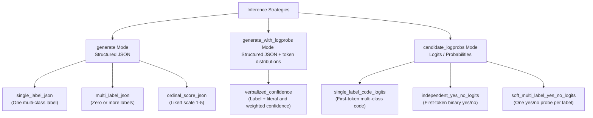

# Review of LLM Inference & Classification Strategies

This document provides a detailed review, explanation, and efficiency analysis of the classification and scoring strategies implemented in `llms-experiments`.

---

## 1. Overview of Strategies

The framework supports three core request modes (`request_mode`):
1. **`generate`**: Generates a structured JSON response under JSON Schema constraints.
2. **`generate_with_logprobs`**: Generates structured JSON and retains a top-token distribution at every generated position.
3. **`candidate_logprobs`**: Captures raw probability scores (logits) of target tokens to determine classes.

Using these modes, the supplied configurations implement seven inference contracts:



---

## 2. Detailed Strategy Mechanics

### Strategy 1: `single_label_json` (Multi-class via JSON)
* **How it works**: The prompt asks the model to output a single label corresponding to the classification task.
* **Output structure**: Enforced by `schema-single-label.json` to be a JSON object containing a `"label"` key with values matching the allowed enum (e.g. `["alpha", "beta", "gamma"]`).
  ```json
  { "label": "alpha" }
  ```
* **Constraint Enforcement**: Uses vLLM's `StructuredOutputsParams` (guided decoding via context-free grammars).

### Strategy 2: `multi_label_json` (Multi-label via JSON)
* **How it works**: The prompt asks the model to output all labels from the label set that apply to the input text.
* **Output structure**: Enforced by `schema-multi-label.json` to return a JSON list of strings under `"labels"`.
  ```json
  { "labels": ["alpha", "gamma"] }
  ```
* **Constraint Enforcement**: Enforces a list of strings matching the allowed categories.

### Strategy 3: `ordinal_score_json` (Ordinal scaling via JSON)
* **How it works**: The prompt asks the model to output a numeric score representing the strength of evidence or category rating.
* **Output structure**: Enforced by `schema-ordinal-score.json` to return an integer between `1` and `5` inclusive.
  ```json
  { "score": 3 }
  ```
* **Constraint Enforcement**: Limits output to a valid Likert scale integer.

### Strategy 4: `single_label_code_logits` (Multi-class via Logits)
* **How it works**:
  1. The prompt formats mapping codes (e.g., `A`, `B`, `C`) and instructs the model: *"Choose exactly one configured code"* and *"Return exactly one candidate token"*.
  2. The runner requests `max_completion_tokens: 1` (or `max_tokens=1` in-process).
  3. The runner requests token logprobs for the top `K` candidates (where $K = \min(20, \text{len(candidates)} + 5)$).
  4. The runner extracts the probability (logprob) of each configured candidate code at the first token position. If a candidate code does not appear in the top $K$ tokens, it is assigned $-\infty$.
* **Output structure**: A dictionary of candidates and their log-probabilities.
  ```json
  {
    "A": -0.15,
    "B": -4.20,
    "C": -12.5
  }
  ```

### Strategy 5: `independent_yes_no_logits` (Binary classification via Logits)
* **How it works**: Identical in mechanism to `single_label_code_logits`, but the candidate set is fixed to `["yes", "no"]`. The runner extracts the relative logprobs of the model generating `"yes"` versus `"no"` as the first token response to a binary question.
* **Output structure**:
  ```json
  {
    "yes": -0.05,
    "no": -6.12
  }
  ```

### Strategy 6: `soft_multi_label_yes_no_logits` (Per-label binary logits)

* **How it works**: The runner expands each source item over the configured label set and issues one independent yes/no request per label.
* **Output structure**: Each Parquet row retains the source item ID, `target_label`, and the raw yes/no candidate log-probabilities. Thresholding and metric computation are left to an independent evaluator.

### Strategy 7: `verbalized_confidence` (Single label with confidence)

* **How it works**: The model returns one label and two separate confidence digits in a schema-constrained JSON object. A single generation therefore supplies both the literal score and the token distributions required for the weighted score.
* **Literal confidence**: `(10 * confidence_tens + confidence_units) / 100`.
